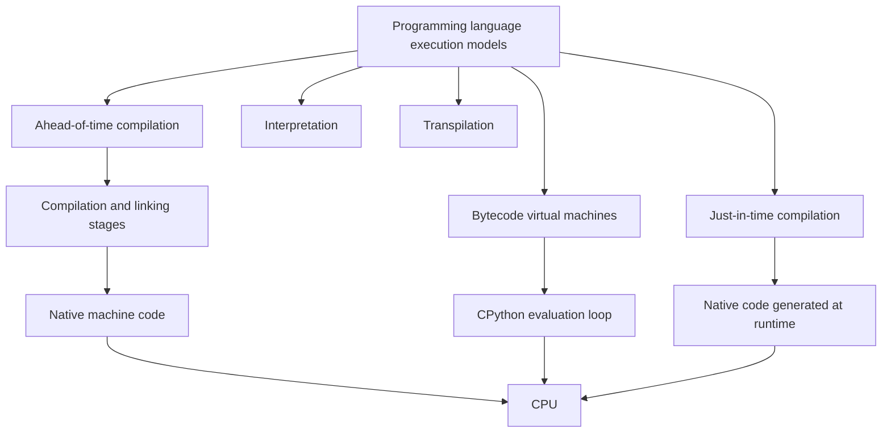

## Overview

Software engineering covers the principles and practices used to design, build, deploy, and maintain reliable software systems. It includes architecture, code quality, concurrency, collaboration, testing, and the management of change over time.

## Learning path

Work from top to bottom and focus on only the first two or three unchecked topics.

### Code execution concept map

This map separates instructions for language tools from instructions the physical CPU can execute:



See [[Programming language execution models]] for the detailed C and CPython execution paths, then continue into [[Ahead-of-time compilation (AOT)]], [[Interpretation]], and [[Bytecode virtual machine]].

### Build and CI concept map

This chain connects the transformation of source code to its automated validation:

```text
Ahead-of-time compilation (including compilation and linking)
        ↓ can be part of
Software build process
        ↓ coordinated by
Software build automation
        ↓ implemented by
Make and Makefiles
        ↓ may be invoked by
Continuous integration
        ↓ platform example
CircleCI
```

### Foundations

- [ ] Software development lifecycle
- [ ] Abstraction and modularity
- [ ] Cohesion and coupling
- [ ] Interfaces and contracts
- [[Programming language execution models]]
- [[Ahead-of-time compilation (AOT)]]
- [[Interpretation]]
- [[Bytecode virtual machine]]
- [ ] [[Software build process]]
- [ ] Testing fundamentals
- [ ] [[Unit tests vs integration tests]]
- [ ] [[Code comments as context for humans and AI]]
- [ ] Refactoring

### Core topics

- [ ] [[DRY principle and knowledge duplication]]
- [ ] [[Orthogonality in software design]]
- [ ] [[Law of Demeter]]
- [ ] [[Application architecture models]]
- [ ] [[Software build automation]]
- [ ] [[Make and Makefiles]]
- [ ] [[Continuous integration]]
- [ ] [[CircleCI]]
- [ ] Dependency management
- [ ] Design patterns

### Advanced topics

- [ ] [[Blackboard architectural pattern]]
- [ ] [[Concurrency and parallelism]]
- [ ] [[Temporal coupling]]

When a topic becomes a developed note, keep its link in the appropriate topical section, remove the checkbox, and move the note from `99 - Concept Inbox` or `98 - Concept Backlog/Tech` to `Tech/10 - Knowledge`.
