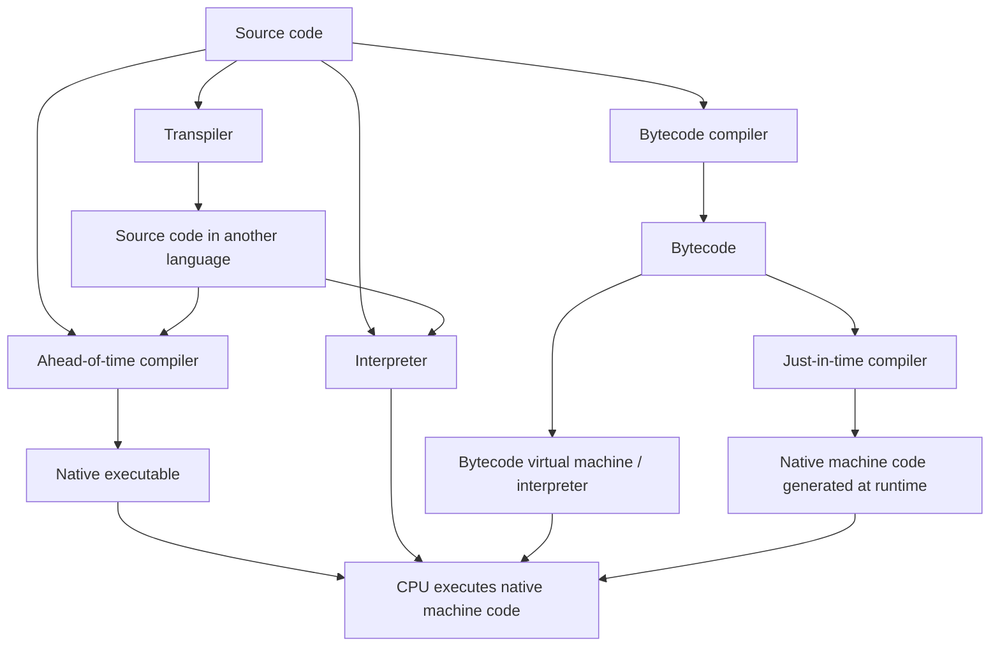
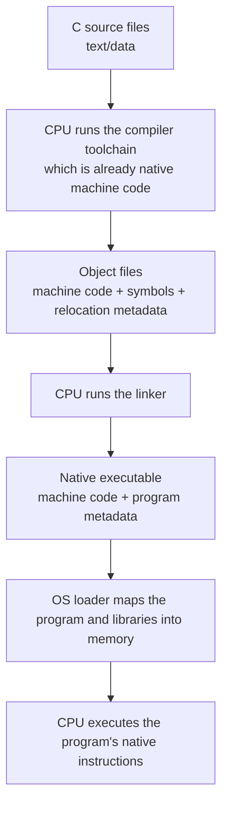
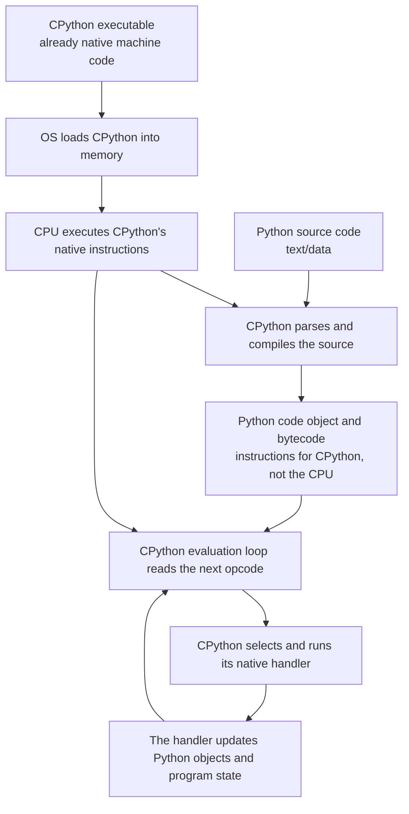

## Summary

A programming language execution model describes how a language implementation gets from source code to native machine instructions that a CPU can execute. Compilation, interpretation, bytecode virtual machines, just-in-time compilation, and transpilation are strategies that implementations can combine.

## The central mental model

The CPU directly executes only the machine instructions defined by its instruction set, such as ARM64 or x86-64. Source code, object files, and Python bytecode are data until an already-running program reads and processes them.

```text
Source code or bytecode = instructions for a compiler, interpreter, or virtual machine
Native machine code     = instructions the CPU can execute directly
```

Compilers, interpreters, linkers, and virtual machines are themselves programs. The CPU runs their native machine code while they translate or carry out the meaning of another program.

## Main execution models



- **[[Ahead-of-time compilation (AOT)]]:** translates code before the program runs, commonly into native machine code.
- **[[Interpretation]]:** an interpreter reads a representation of the program and performs the requested operations while it runs.
- **[[Bytecode virtual machine]]:** executes instructions for a software-defined machine rather than the physical CPU's instruction set.
- **Just-in-time compilation (JIT):** generates native machine code while the program is running, often for frequently executed code.
- **Transpilation:** translates source code into another source language that still needs its own execution path.

These are not mutually exclusive categories. One implementation can compile source to bytecode, interpret that bytecode, and JIT-compile selected parts. It is therefore more precise to describe a language implementation than to label an entire language as simply “compiled” or “interpreted.”

## C: ahead-of-time compilation and direct execution



The toolchain may internally preprocess, compile, and assemble the program. Assembly language is a human-readable notation for machine instructions; a compiler may produce it as an intermediate representation, but it does not have to save an assembly file.

Object files already contain machine code, but they are not normally complete programs. As part of [[Ahead-of-time compilation (AOT)]], linking resolves symbols and combines object files and libraries into an executable or library. When the program starts, the operating system's loader places the executable and required shared libraries into memory before transferring control to its entry point.

## Python with CPython: native interpreter executing bytecode



For example:

```python
result = a + b
```

The simplified execution is:

```text
Python bytecode requests an addition
                ↓
CPython reads that bytecode instruction
                ↓
CPython checks the Python types of a and b
                ↓
CPython selects its existing addition implementation
                ↓
The CPU executes that implementation's native machine instructions
```

CPython acts as a [[Bytecode virtual machine]] that normally uses [[Interpretation]]. It does not need to translate each bytecode instruction into a matching CPU instruction. Its evaluation loop and operation handlers were compiled into native machine code when CPython itself was built. Bytecode tells that already-running native program which Python operation to perform next.

A CPython build with a JIT can add another path for selected code:

```text
Python bytecode → JIT compiler → newly generated native machine code → CPU
```

## Where assembly fits

For a practical software and data engineering mental model, it is enough to understand that:

- Assembly is a readable representation of machine instructions.
- Registers are small, fast storage locations inside the CPU.
- Load and store instructions move data between memory and registers.
- Arithmetic and comparison instructions operate on values.
- Branch instructions implement decisions and loops.
- Calling conventions define how functions receive arguments and return results.
- Symbols such as function names are connected to addresses during linking and loading.

This helps explain Python/C extension boundaries, ARM versus x86 container compatibility, native-library errors, why vectorized native code can outperform Python loops, and how runtime systems such as the JVM generate and execute code.

## Connections

- Execution models: [[Ahead-of-time compilation (AOT)]], [[Interpretation]], [[Bytecode virtual machine]]
- Related process: [[Software build process]]
- Related tools: [[Software build automation]]
- Next topic: Machine code and assembly language
- Sources:
